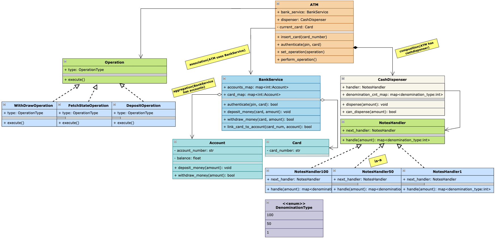

## Requirements

1. The ATM system should support basic operations such as balance inquiry, cash withdrawal, and cash deposit.
2. Users should be able to authenticate themselves using a card and a PIN (Personal Identification Number).
3. The system should interact with a bank's backend system to validate user accounts and perform transactions.
4. The ATM should have a cash dispenser to dispense cash to users which should also handle different note denominations.
5. The system should handle concurrent access and ensure data consistency.
6. The ATM should have a user-friendly interface for users to interact with.

## Class Diagram

## Overview

1. `ATM`: entry point to deal with all downstream services.
2. `BankService`: provides every bank related service.
3. `Account`: consists of account details such as account number, balance and card with debit and credit methods.
4. `Operation`: interface for allowing user for different types of operations such as:
    - WithdrawalOperation
    - DepositOperation
    - BalanceInquiryOperation
5. `Card`: consists of card number and pin.
6. `CashDispenser`: A Cash Dispenser is the hardware that physically gives money to the user.
    - should support can_dispense, dispense, refill
7. `NotesHandler`: A Notes Handler is responsible for dispensing cash in different denominations. It uses the `Chain of Responsibility` pattern to handle different note denominations.
    - `Notes10Handler`
    - `Notes50Handler`
    - `Notes100Handler`

## Key Takeaway

1. Used `facade pattern` and created a `ATM` which is entry point to use `BankService`, `CashDispenser`.
2. Used `command pattern` for different operations(also follows `open/closed` principle) such as withdrawal, deposit and balance inquiry. hence whenever we have multiple operations for a specific task, we can use command pattern to encapsulate the operation and make it interchangeable.
3. Used `chain of responsibility pattern` for cash dispenser to handle different note denominations. hence whenever we have multiple handlers for a specific task, we can use chain of responsibility pattern to encapsulate the handler and make it interchangeable.
4. Used `double checked locking` at withdraw operations to ensure thread safety and avoid race conditions.
5. Used `locks` at account / bank service level to ensure thread safety and avoid race conditions.
6. Highlighted relationships such as `association`, `composition` and `aggregation` to model the relationships between different classes. for example, `ATM` has a `BankService` and a `CashDispenser`, which is a composition relationship, while `BankService` has a collection of `Account` objects, which is an aggregation relationship.