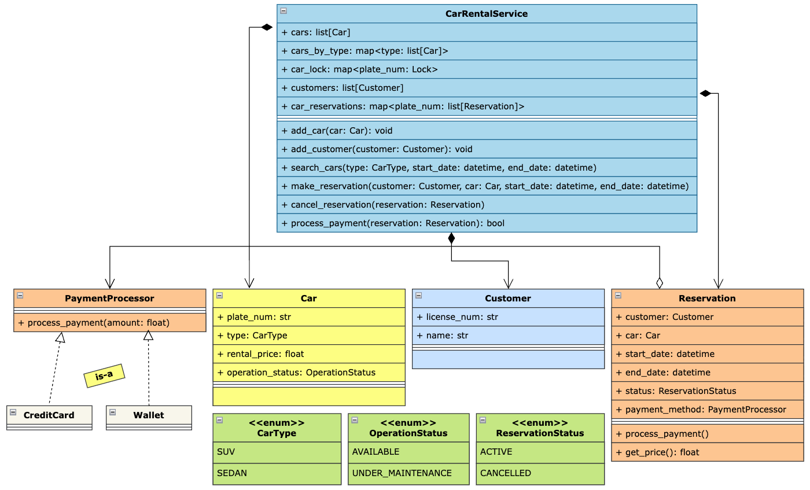

## Requirements

1. The car rental system should allow customers to browse and reserve available cars for specific dates.
2. Each car should have details such as license plate number, and rental price per day.
3. Customers should be able to search for cars based on various criteria, such as car type, and availability for given start and end dates.
4. The system should handle reservations, including creating, modifying, and canceling reservations.
5. The system should keep track of the availability of cars and update their status accordingly.
6. The system should handle customer information, including name and driver's license information.
7. The system should handle payment processing for reservations.
8. The system should be able to handle concurrent reservations and ensure data consistency.

## Class Diagram

## Overview

1. `CarRentalService`: The main entry point that orchestrates the entire car rental workflow. It manages cars, customers, reservations, searching, concurrency control, and delegates payment processing through the configured payment strategy.

2. `Car`: Represents a car available for rental. It contains details such as the license plate number, car type, rental price per day, and operational status (e.g., available or under maintenance).

3. `Customer`: Represents a customer using the rental system. It stores customer information such as name and driver's license number.

4. `Reservation`: Represents a booking made by a customer for a specific car over a given date range. It maintains reservation details, current reservation status, and delegates payment processing using the configured payment processor.

5. `PaymentProcessor`: An interface that defines the payment processing contract. It follows the Strategy Pattern to support multiple payment methods.
   * `CreditCardPaymentProcessor`
   * `WalletPaymentProcessor`

6. `OperationStatus`: Enum representing the operational status of a car.
   * `AVAILABLE`
   * `UNDER_MAINTENANCE`

7. `ReservationStatus`: Enum representing the current state of a reservation.
   * `ACTIVE`
   * `CANCELLED`

## Key Takeaway

## Key Takeaway

1. Used the `Strategy Pattern` for payment processing, allowing multiple payment methods (Credit Card, Wallet, etc.) to be added without modifying the reservation workflow, thus adhering to the `Open/Closed Principle`.
2. Optimized car searching by maintaining an index (`cars_by_type`) and optimized reservation lookup by keeping reservations sorted for each car and using `binary search` to efficiently detect overlapping reservations and determine the insertion position.
3. Used `fine-grained locking` (one lock per car) to ensure thread safety while maximizing concurrency. This allows multiple users to reserve different cars simultaneously while preventing concurrent reservations for the same car.
4. Performed the availability check and reservation creation inside the same critical section to avoid race conditions and guarantee that no two users can successfully reserve the same car for overlapping time periods.
5. Optimized for `high read throughput` by allowing lock-free searches (eventually consistent reads) while enforcing `strong consistency` during reservation creation and cancellation.

**Note**: In this we can use `factory pattern` for easy creation of `vehicles` or `payment method object`, we can also add repository to avoid making rental svc the god class and can also create various strategies for calculating the price due to bussiness logic.