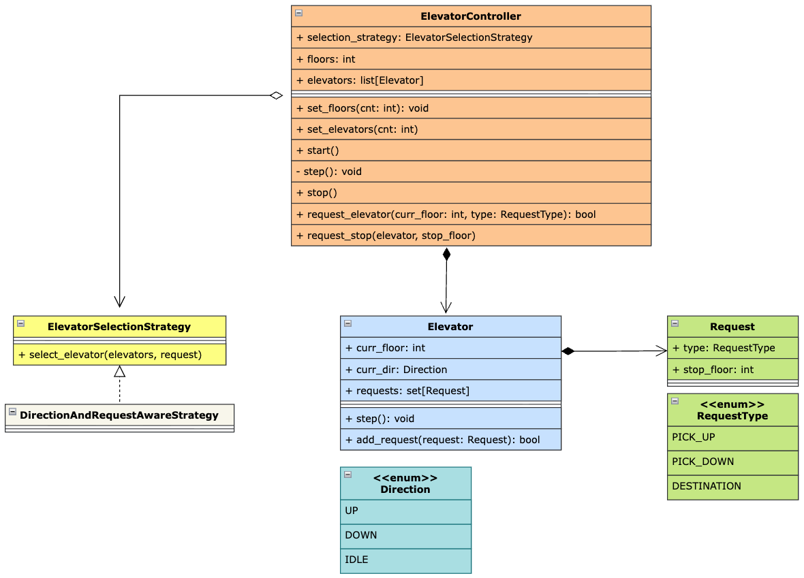

## Requirements

1. System manages N elevators serving M floors.
2. Users can request an elevator from any floor and System decides which elevator to dispatch.
3. Once inside, users can select one or more destination floors.
4. Simulation runs in discrete time steps (e.g., a `step()` call advances time).
5. Elevator stops come in two types:
    - Hall calls: Request from a floor with direction (UP or DOWN)
    - Destination: Request from inside elevator (no direction specified)
6. The system must track multiple pending pickup and destination requests at once, across different floors and elevators, and eventually service all of them correctly.
7. Invalid requests should be rejected (return false).
8. The base simulation is single-threaded — requests and 
   step() calls happen one at a time, in order. As an extension, the system 
   should handle hall calls arriving concurrently from multiple sources 
   (e.g., real hardware where several floor buttons could be pressed at the 
   same instant), guarding against two specific races:
    a. Two simultaneous request_elevator() calls both seeing the same elevator 
        as idle and both dispatching to it (select + assign must be atomic).
    b. step() iterating/modifying an elevator's request set while add_request() 
        writes to that same set from another thread (concurrent modification).
9. (Extensibility) The demo/runner must allow step() to advance the 
    simulation continuously (e.g., in a loop or on a timer) while still 
    accepting new request_elevator() calls in between — the architecture 
    must not let one block the other from ever running.

## Class Diagram

## Overview

1. `ElevatorController`: The main entry point that orchestrates the elevator system. It manages elevators, validates requests, delegates elevator selection to the configured selection strategy, handles hall calls and destination requests, and coordinates the periodic movement of all elevators.
2. `Elevator`: Represents an individual elevator. It maintains its `current floor`, `direction`, and `requests`. It is responsible for processing requests, moving one floor at a time, opening the door when a request is fulfilled, and reversing direction when there are no more requests ahead.
3. `Request`: Represents a request made to the elevator system. It contains the requested floor and the type of request.
5. `ElevatorSelectionStrategy`: Interface that defines the contract for selecting the best elevator for a hall call. It follows the `Strategy Pattern`, allowing different elevator-selection algorithms to be plugged into the controller.

## Key Takeaway

1. Used the `Strategy Pattern` for elevator selection, allowing different algorithms for selecting an elevator to be introduced without modifying the `ElevatorController`, thus adhering to the `Open/Closed Principle`.
2. Used a `SCAN-like scheduling approach` for elevator movement. An elevator continues moving in its current direction while there are pending requests ahead and reverses direction when there are no more requests in the current direction.
3. Used `direction-aware elevator selection` for hall calls. The system first tries to find an elevator already moving toward the requested floor and in the requested direction, then falls back to the nearest idle elevator and finally the nearest elevator.
4. Maintained pending requests using a `set` inside each elevator, which prevents duplicate requests for the same floor and request type through the `Request` object's `__hash__` and `__eq__` implementations.
5. Used a `controller-level lock` to synchronize request assignment and elevator movement. Both adding requests and executing the `step()` operation are performed inside the same critical section, preventing a request from being assigned while the elevator state is being modified concurrently.
6. Kept `Elevator` responsible for its own movement and request processing while `ElevatorController` is responsible for coordinating multiple elevators and handling system-level operations.
7. Separated `hall calls` from `destination requests`. Hall calls are handled by the controller and require elevator selection, whereas destination requests are directly added to the selected elevator after a passenger enters the elevator.
8. Used a periodic `step()` simulation where the controller periodically invokes `step()` on every elevator. This keeps the movement logic independent from the request-generation logic and allows multiple elevators to progress independently.
