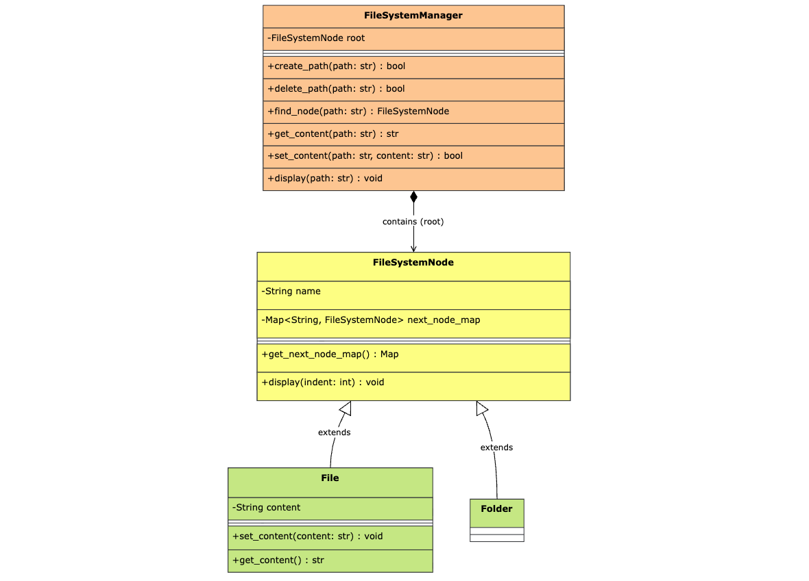

## Requirements

1. Hierarchical structure — paths delimited by `/` (e.g. `/a/b/c.txt`), modeled as a tree of `Directory` (composite) and `File` (leaf) nodes.
2. Create — `createPath(path)`: create a file or directory at the given path.
3. Read — `getNode(path)` / `getFileContent(path)`: fetch a node or its associated value.
4. Update — `setFileContent(path, content)`: update the value stored at a file path.
5. Delete — `deletePath(path)`: remove a node (and its subtree, if a directory).
6. Path validation — `isValidFilePath(path)`: check format validity; **parent must exist** before a child path can be created (checked via `getParentPath` + node lookup).
7. Efficient storage/retrieval — children stored as a map at each node → path resolution in O(depth), not O(total nodes).
8. Path–value association — only `File` nodes carry a value (`content`); `Directory` nodes are purely structural (hold children only).

## Class Diagram

## Overview

1. `FileSystemNode` (base class) — holds name + next_node_map, common display() function.
2. `File` (leaf) — adds content, the path–value association.
3. `Folder` (composite) — pure structure, no extra fields.
4. `FileSystemManager` — facade owning root, exposing all CRUD + validations and mainly implemented trie to store and retrieve files in O(depth).

## Key Takeaway

1. Used the `Composite Pattern` for the filesystem hierarchy — `File` (leaf) and `Folder` (composite) both extend `FileSystemNode`, allowing uniform tree traversal (`display()`) regardless of node type, without the manager needing to special-case files vs folders.
2. Modeled each `FileSystemNode` with a `Map<String, FileSystemNode>` for children instead of storing full path strings, enabling path resolution in `O(depth)` rather than `O(total nodes)` — this is the core reason a `Trie-like structure beats a flat map keyed by full path`.
3. Centralized path resolution in a single `find_node()` helper and reused it across `get_content`, `set_content`, and `delete_path` — avoiding duplicated tree-walk logic and ensuring validation behaves consistently everywhere instead of being reimplemented (and potentially inconsistently) in each method.
4. Adopted a consistent `return True/False/None` contract instead of raising exceptions for expected failure cases (missing path, wrong node type) — exceptions are reserved for truly exceptional states, not for normal control flow like "path not found," which keeps the API predictable for callers.

## Note

- we can create next node map in folder class as well because file is the `leaf` node.