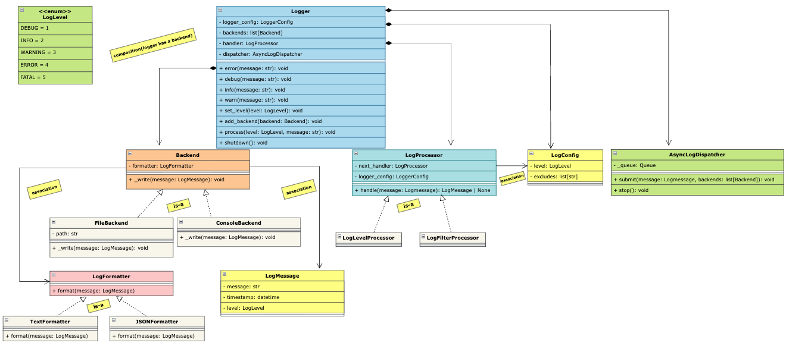

## Requirements

1. The logging framework should support different log levels, such as DEBUG, INFO, WARNING, ERROR, and FATAL.
2. It should allow logging messages with a timestamp, log level, and message content.
3. The framework should support multiple output destinations, such as console, file, and database.
4. It should provide a configuration mechanism to set the log level and output destination.
5. The logging framework should be thread-safe to handle concurrent logging from multiple threads.
6. It should be extensible to accommodate new log levels and output destinations in the future.
7. Support structured/formatted output (plain text vs JSON) via pluggable formatters.
8. Before a log message is written to an output destination, it should pass through a configurable processing pipeline (e.g., filtering, masking sensitive information), where each processor can modify, reject, or forward the log message.
9. The logging framework should support asynchronous logging by queuing log messages and processing them in the background, ensuring that application threads are not blocked by slow output destinations.
10. Provide graceful shutdown — flush any buffered/queued logs before the application exits.
11. A failure in one output destination (e.g., DB unreachable) must not affect delivery to other destinations or crash/block the application.

## Class Diagram

## Overview

1. `Logger`: The main entry point for logging messages and act as manager for submitting message to processing pipeline and output destinations.
2. `LogMessage`: Represents a log message with attributes such as timestamp, log level, and message content.
3. `LogLevel`: Enum representing different log levels (DEBUG, INFO, WARNING, ERROR, FATAL).
4. `LogFormatter`: Interface for formatting log messages into different representations (e.g., plain text, JSON). Implementations can be provided for different formats.
5. `LogProcessor`: Interface for processing log messages before they are written to output destinations. Implementations can include filtering, masking sensitive information, or enriching log messages.
6. `Backend`: Interface for output destinations (e.g., console, file, database). Implementations must handle the actual writing of log messages and should own the format.
7. `AsyncLogDispatcher`: Responsible for queuing log messages and processing them asynchronously in the background, ensuring that application threads are not blocked by slow output destinations.
8. `LogConfig`: Represents the configuration for the logging framework, including log level and other rules.

## Key Takeaway

1. Used `chain of responsibility pattern` for log processing pipeline to handle different log processors.
2. Used `singleton pattern` for `Logger` to ensure a single instance of the logger is used throughout the application.
3. Used `strategy pattern` for log formatting to allow different formatting strategies (e.g., plain text, JSON) to be applied to log messages.
4. Used `Queue` for asynchronous logging to ensure that log messages are processed in the background without blocking application threads.
5. Used `Event(Thread safe boolean)` for graceful shutdown to ensure that any buffered/queued logs are flushed before the application exits.
6. Used `Polymorphism` to allow different output destinations (e.g., console, file, database) to be handled through a common interface (`Backend`), making it easy to add new output destinations in the future.