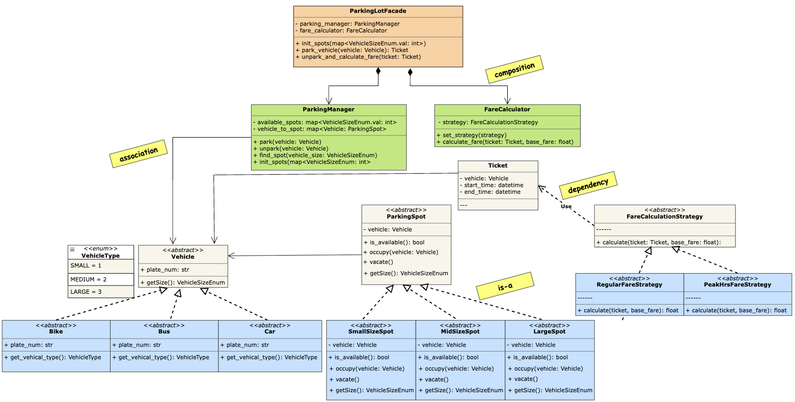

## Requirements

#### Here are the key functional requirements we’ve identified:

1. The parking lot has multiple parking spots, including compact, regular, and oversized spots.
2. The parking lot supports parking for motorcycles, cars, and trucks.
3. Customers can park their vehicles in spots assigned based on vehicle size.
4. Customers receive a parking ticket with vehicle details and entry time at the entry point and pay a fee based on duration, vehicle size, and time of day at the exit point.

#### Below are the non-functional requirements:

1. The system must scale to support large parking lots with many spots and vehicles.
2. The system must reliably track spot assignments and ticket details to ensure accurate operations.
With these requirements set, we now identify the core objects.

## Class Diagram

## Overview

- `Vehicle<interface>`: consists of plate number / vehicle details and vehicle type.
    - bus
    - car
    - bike
- `VehicleType<enum>`: enum based on spot sizes.
    - small
    - medium
    - large
- `ParkingSpot<interface>`: consists of parking spot details like availability and type with methods to occupy and vacate the spot.
    - small
    - mid
    - large
- `FareCalculationStrategy<interface>`: consists of calculate function.
    - regular_fare_strategy
    - peak_hrs_fare_strategy
- `Ticket<dataclass>`: consists of ticket details.
- `FareCalculator`: context for strategy patters.
- `ParkingManager`: consists of spot collection, occupy, vacate, find spot for vehicle, init spots.
- `ParkingLotFacade`: entry point to use parking manager and fare calculator service.

## Key Takeaway

1. used `facade pattern` and created a `ParkingLotFacade` which is entry point to use `ParkingManager` and `FareCalculator` service.
2. used `strategy pattern` for fare calculation based on time of day. hence whenever we have multiple algorithms for a specific task, we can use strategy pattern to encapsulate the algorithm and make it interchangeable.
3. used `interface` for `Vehicle` and `ParkingSpot` to define the contract for different types of vehicles and parking spots. following the open/closed principle, we can add new vehicle types and parking spot types without modifying existing code.
4. used `enum` for `VehicleType` to define the different types of vehicles and their corresponding parking spot sizes. this makes it easy to add new vehicle types and parking spot sizes in the future.
5. different relations used such as `association`, `composition` and `aggregation` to model the relationships between different classes. for example, `ParkingManager` has a collection of `ParkingSpot` objects, which is an aggregation relationship, while `ParkingLotFacade` has a `ParkingManager` and a `FareCalculator`, which is a composition relationship.