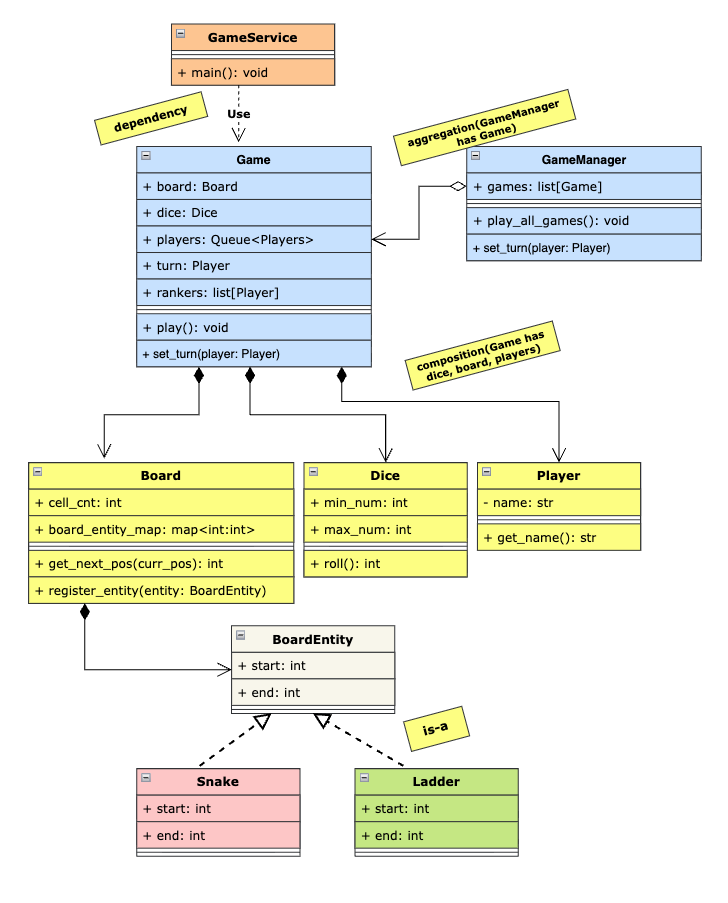

## Requirements

1. The game should be played on a board with numbered cells, typically with 100 cells.
2. The board should have a predefined set of snakes and ladders, connecting certain cells.
3. The game should support multiple players, each represented by a unique game piece.
4. Players should take turns rolling a dice to determine the number of cells to move forward.
5. If a player lands on a cell with the head of a snake, they should slide down to the cell with the tail of the snake.
6. If a player lands on a cell with the base of a ladder, they should climb up to the cell at the top of the ladder.
7. The game should continue until one of the players reaches the final cell on the board.
8. The game should handle multiple game sessions concurrently, allowing different groups of players to play independently.

## Class Diagram

## Overview

1. `GameService`: responsible for creating game instances and playing them.
2. `GameManager`: manages multiple game sessions, allowing them to run concurrently.
3. `Game`: represents a single game session, managing players, dice, turns, and the game board.
4. `GameBuilder`: a helper class for constructing game instances with all necessary components.
5. `Board`: represents the game board, containing cells, snakes, and ladders.
6. `BoardEntity`: an abstract class for entities on the board, such as snakes and ladders.
7. `Dice` and `Player`: represent the dice used for rolling and the players participating in the game, respectively.

## Key Takeaway

1. Used `builder pattern` to create a `Game` instance with all necessary components, allowing for flexible and readable game construction.
2. Used `deque` to manage player turns efficiently, allowing for easy rotation of players after each turn.
3. Implemented `concurrent game sessions` using threading, allowing multiple games to run independently without interfering with each other.
4. For `concurrency` created a `GameManager` class which will manage all the games and will run them concurrently using threads. Each game will be run in a separate thread, allowing multiple games to be played simultaneously without blocking each other.