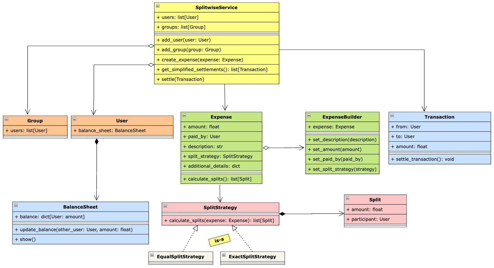

## Requirements

1. The system should allow users to create accounts and manage their profile information.
2. Users should be able to create groups and add other users to the groups.
3. Users should be able to add expenses within a group, specifying the amount, description, and participants.
4. The system should automatically split the expenses among the participants based on their share.
5. Users should be able to view their individual balances with other users and settle up the balances.
6. The system should support different split methods, such as equal split, percentage split, and exact amounts.
7. Users should be able to view their transaction history and group expenses.
8. The system should handle concurrent transactions and ensure data consistency.

## Class Diagram

## Overview

1. `SplitWiseService`: the main entry point of the application. Manages users and groups, creates expenses, generates simplified settlements, and settles transactions.
2. `User`: represents a Splitwise user and maintains their `BalanceSheet` to track balances with other users.
3. `Group`: represents a group of users participating in shared expenses.
4. `Expense`: represents an expense with its amount, payer, description, split strategy, and additional details.
5. `ExpenseBuilder`: responsible for constructing `Expense` objects with different configurable properties in a readable way.
6. `SplitStrategy`: abstraction for calculating how an expense should be divided. `EqualSplitStrategy` and `ExactSplitStrategy` provide different implementations.
7. `Split`: represents an individual user's share of an expense.
8. `BalanceSheet`: maintains the amount a user owes to or is owed by other users.
9. `Transaction`: represents a settlement between two users and is responsible for performing the actual money transfer.

## Key Takeaway

1. Used `strategy pattern` for expense splitting. `EqualSplitStrategy` and `ExactSplitStrategy` encapsulate different splitting algorithms, allowing new split types to be added without modifying `Expense`.
2. Used `builder pattern` to construct `Expense` objects.
3. Used `composition` between `User` and `BalanceSheet` because a balance sheet belongs to a user and is created along with the user.
4. Used `SplitWiseService` as the main service/facade layer, providing a single entry point for operations such as creating expenses, calculating simplified transactions, and settling payments.
5. Implemented `transaction simplification` by first calculating each user's net balance and then using `heaps` to match `debtors with creditors`, reducing the number of settlement transactions. So overall we used `greedy` algo to get minimum transactions.
6. Added `concurrency control` at the service level using a lock around operations such as `create_expense()` and `settle()`, ensuring that balance updates belonging to a single operation happen atomically.
7. Kept `BalanceSheet` as a data component without its own lock because `SplitWiseService` owns the transaction boundary and controls balance mutations, avoiding unnecessary nested locks and potential deadlocks.

## Note

1. If there are `n` people with non-zero net balances in a group, the `greedy heap/sort` approach never needs more than `n - 1` transactions to settle everyone.
2. It's not proven to be the absolute theoretical minimum for every input — that's the `NP-hard` part — but `n-1` is a solid, efficient, and easy-to-justify bound.