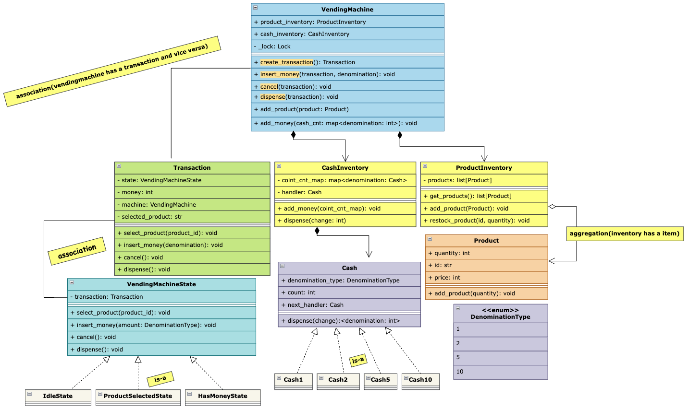

## Requirements

1. The vending machine should support multiple products with different prices and quantities.
2. The machine should allow customers to view all available products.
3. The machine should allow customers to select a product.
4. The machine should accept coins of different denominations.
5. The machine should allow money to be inserted in multiple steps.
6. The machine should keep track of the total amount inserted for the current transaction.
7. The machine should dispense the selected product, appropriate change.
8. The machine should allow customers to cancel the transaction and receive a full refund before dispensing.
9. The machine should support multiple concurrent transactions while ensuring data consistency.
10. The machine should ensure thread-safe updates to product inventory and cash inventory.

## Class Diagram

## Overview

1. `VendingMachine`: The main class that manages products, cash inventory, and transactions.
2. `ProductInventory`: Manages the inventory of products, including adding, removing, and checking availability.
3. `CashInventory`: Manages the cash inventory, including adding, removing, and dispensing coins of different denominations.
4. `Transaction`: Represents a single transaction, keeping track of the selected product, inserted money, and transaction state.
5. `VendingMachineState`: An abstract class representing the state of the vending machine, with concrete implementations for different states (e.g., Idle, ProductSelected, HasMoney).

## Key Takeaway

1. Used `State Design Pattern` to manage the different states of the vending machine, allowing for clear separation of concerns and easier maintenance.
2. Implemented `Chain of Responsibility Pattern` in the `CashInventory` class to handle dispensing change in a flexible and extensible manner.
3. Ensured `thread safety` in the `VendingMachine`, `ProductInventory`, and `CashInventory` classes to support concurrent transactions without data inconsistencies.
4. Added Lock at `VendingMachine` level to ensure that only one transaction can make a purchase or update cash and product inventory at a time, preventing race conditions and ensuring data integrity.
5. `CashInventory` has a `Cash` and its `composition` because `CashInventory` is creating a `Cash` object whereas `ProductInventory` is not creating a `Product` object. `ProductInventory` is just managing the products and their quantities hence it is `aggregation`.